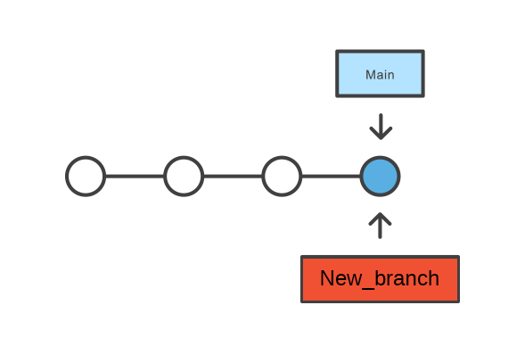

[К содержанию](./readme.md)

## Создание веток (branch)

---


### git branch


***Ветки***— это просто указатели на коммиты. Когда создается ветка, git просто создает новый указатель. Репозиторий при этом никак не изменяется.   
    Разработка в отдельных ветках позволяет работать над ними параллельно и предотвращает попадание сомнительного кода в главную ветку main.



 Чтобы добавить в эту ветку коммиты, необходимо выбрать ее с помощью команды [git checkout](./checkout.md), а затем использовать стандартные команды [git add](./add.md) и [git commit](./commit.md).


## Отображение списка веток в репозитории

**git branch** - отображает список веток в репозитории.

```bash=
git branch
```

## Создание новой ветки с именем

**git branch *[new_branch]*** - эта команда создает новую ветку с именем. 

```bash=
git branch <new-branch>
```


## Удаление указанной ветки.

**git branch -d *[name]*** - команда для удаления указанной ветки. Это «безопасная» операция, поскольку git не позволит удалить ветку, если в ней есть неслитые изменения.


```bash=
git branch -d <name>
```

## Изменение имени текущей ветки

**git branch -m *[new_name]*** - команда позволяет переименовать текущую ветку.

```bash=
git branch -m <new-name>
```
